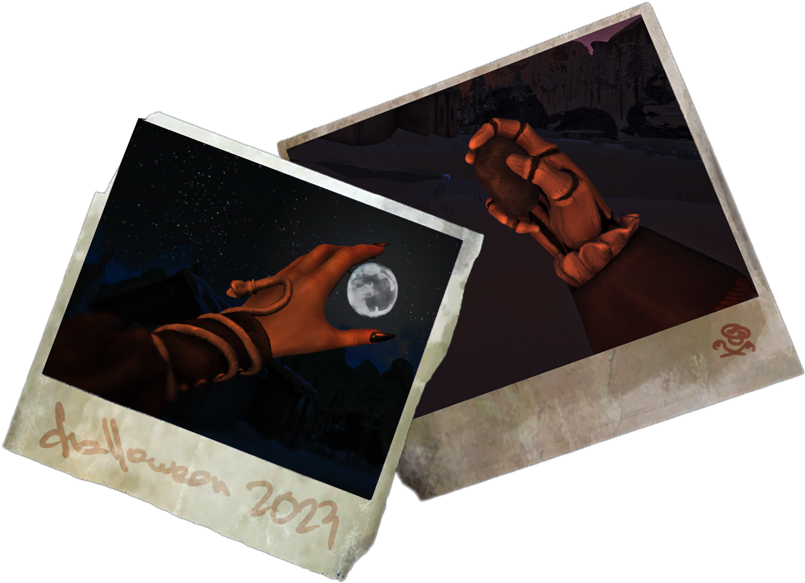

## Community created custom meshes are available in [my channel on TLD Modding Discord](https://discord.com/invite/2tWMRE5tZp)

# 0.7.0 - Stripped version
Since Hinterland added their own first person clothing, main purpose of this mod is lost.

Current features:
- hands/arms and paper doll texture replacement and tint(to imitate skin tones)
- custom event outfits
- hands FOV setting
- option to replace character arms with your own custom mesh (check instructions [here](https://github.com/HAHAYOUDEAD/Personality/wiki#custom-mesh-creation)⁠)
- option to hide gloves
- option to make character left-handed 

# 0.6.5 - Howl-oween update!
A little special something for the Halloween spirit

# Personality
Lets you customize your character: replace textures and change outfit. [Funny video](https://youtu.be/jm8WjlVVtw8)

https://user-images.githubusercontent.com/46863862/203854709-c9b64ea2-1102-49a4-a711-e809c015e9e4.mp4

# Installation
Install [MelonLoader](https://github.com/LavaGang/MelonLoader) if it's your first mod

Get the latest [release](https://github.com/HAHAYOUDEAD/Personality/releases) and extract into `.../Mods/`

Requires [ModSettings](https://github.com/zeobviouslyfakeacc/ModSettings/releases) (also just drop it's .dll into `.../Mods/`)

# Possible upcoming features
- Make compatible with mods that use custom arms (Pastime Reading, Binoculars)
- Custom trinkets (for example bracelet for Astrid and watch for Will)
- Dynamic paperdolls (showing injures, fatigue and probably something else)
- 2 new characters. They are done conceptually, I would need to add the clothes, proper first person models and paperdolls. So it might take a while

